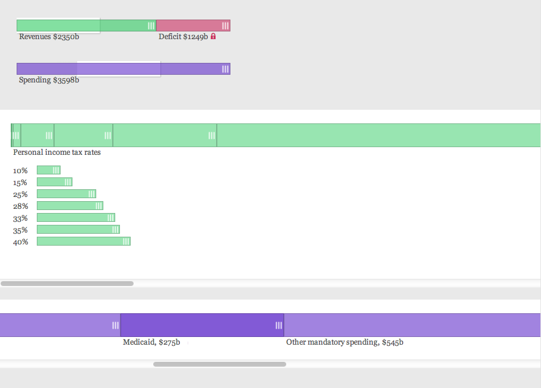

Scrubbing Budget
================

An interactive exploration of the US Federal Budget based on linear constraint programming in Cassowary. Built for my JSConf 2013 talk: [Constraint programming in the browser](http://adamsolove.com/js/2013/10/15/constraint-programming-in-the-browser.html)

Credits
-------

None of this is creditable to me. Instead, go see:

* Alex Russell [updated](https://github.com/slightlyoff/cassowary-js-refactor) Greg Badros' [javascript version](http://badros.blogspot.com/2011/05/cassowary-constraint-solver-in.html) of the [Cassowary toolkit](http://www.cs.washington.edu/research/constraints/cassowary/).

